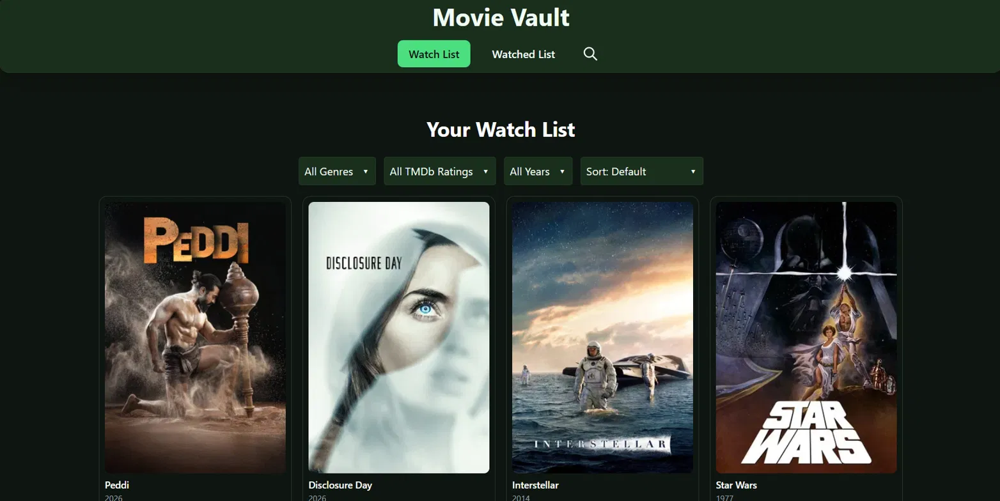
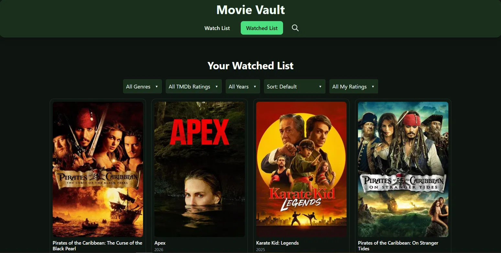
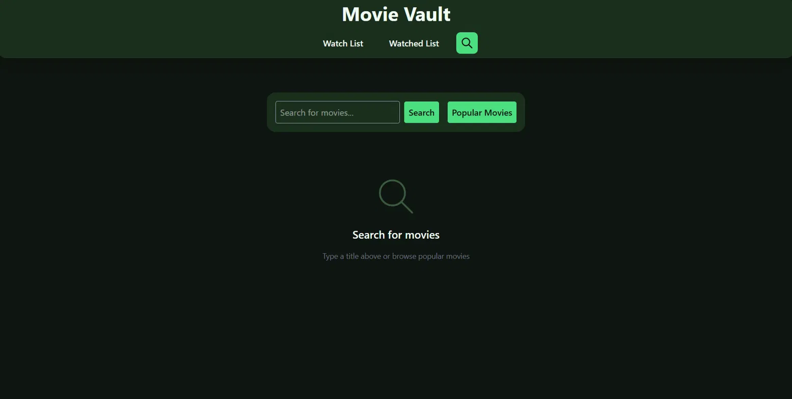

# 🎬 Movie Vault

A full-stack movie tracking app that lets users search for films, manage a personal watchlist, and keep track of movies they've already watched — complete with personal ratings and filters.

**Live Demo:** [movie-search-app-six-eta.vercel.app](https://movie-search-app-six-eta.vercel.app)

---

## Screenshots





---

## Tech Stack

**Frontend**
- React 19
- Redux Toolkit (global state management)
- React Router v7 (client-side routing)
- Tailwind CSS v4 (styling)
- Axios (HTTP requests)
- Vite (build tool)

**Backend**
- Node.js + Express
- JSON file storage (`watchlist.json`, `watched.json`)
- Deployed on Railway

**External API**
- [TMDB (The Movie Database)](https://www.themoviedb.org/) — movie search, details, and popular movies

---

## Features

### Search
- Search for any movie by title using the TMDB API
- Browse a curated list of currently popular movies
- Results display poster, title, release year, and TMDb rating
- Badges indicate if a movie is already in your Watchlist or Watched list
- Skeleton loading cards shown while fetching results

### Watchlist
- Add movies from search results to your personal watchlist
- Filter by genre, TMDb rating, release year, and sort order
- Mark movies as watched directly from the watchlist (with optional personal rating)
- Remove movies from the watchlist

### Watched List
- Tracks all movies you've marked as watched
- Add or edit a personal rating (1–10) for each movie
- Filter by genre, TMDb rating, release year, sort order, and personal rating
- Move movies back to the watchlist
- Remove movies from the watched list

### General
- Movie detail modal with poster, overview, release date, TMDb rating, genres, and personal rating
- Empty state illustrations for each page
- Toast notifications for all user actions (add, remove, move, rate)
- Fully responsive — works on mobile and desktop

---

## Use Case

Movie Vault is built for casual film fans who want a simple, personal way to keep track of what they want to watch and what they've already seen — without needing a full account-based platform. Users can browse popular titles or search for specific films, build a watchlist, and log their watched movies with a personal rating for future reference.

---

## Project Structure

```
movie-search/
├── backend/
│   ├── data/
│   │   ├── watchlist.json
│   │   └── watched.json
│   └── server.js
├── src/
│   ├── components/
│   │   ├── EmptyState.jsx
│   │   ├── Filter.jsx
│   │   ├── Modal.jsx
│   │   ├── MovieCard.jsx
│   │   ├── NavigationBar.jsx
│   │   └── SkeletonCard.jsx
│   ├── pages/
│   │   ├── SearchPage.jsx
│   │   ├── WatchList.jsx
│   │   └── WatchedList.jsx
│   └── store/
│       └── moviesSlice.js
```

---

## Future Improvements

- **User accounts** — allow multiple users to have their own independent watchlist and watched list
- **Database storage** — migrate from JSON file storage to a proper database (PostgreSQL or MySQL) for better scalability
- **Review system** — let users write short text reviews alongside their personal ratings
- **Social sharing** — share your watchlist or watched list with friends via a public link
- **Movie recommendations** — suggest similar movies based on what's already in the watched list
- **Notifications** — alert users when a movie on their watchlist becomes available on a streaming platform
